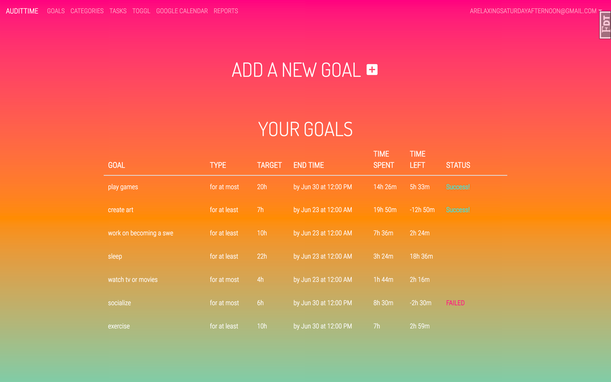

# AuditTime
AuditTime is a web app that helps you budget and track your time. For example,
if you're trying to break your Netflix binge habit, you can set a goal to 
watch at most 1 hour of tv this week. During the week, log the time you 
spent watching tv. Integrations with Toggl and Google Calendar make it even 
easier to track your time.

# Tech
**Backend:** Python 2.7, Flask, Postgres
**Frontend:** JavaScript (jQuery), Jinja, chart.js
**APIs:** Toggl, Google Calendar